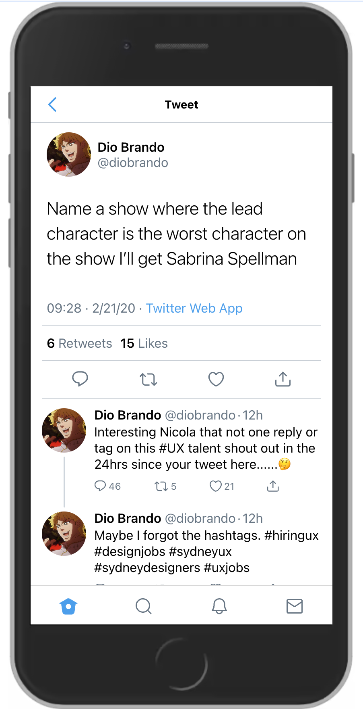

## Twitter Clone

I'm creating Twitter app on React Native following this [Figma design by Pixsellz](https://www.figma.com/file/pMHTDS5kpkqfdqnvMP7riX). This design is from older Twitter versions and has small differences from current X (Formerly Twitter). Currently it has many things missing which I will be adding.

Example Tweet detail page:

## How to Run

### Installation

`npm run dev`

### Run on Web

`npm run web`
